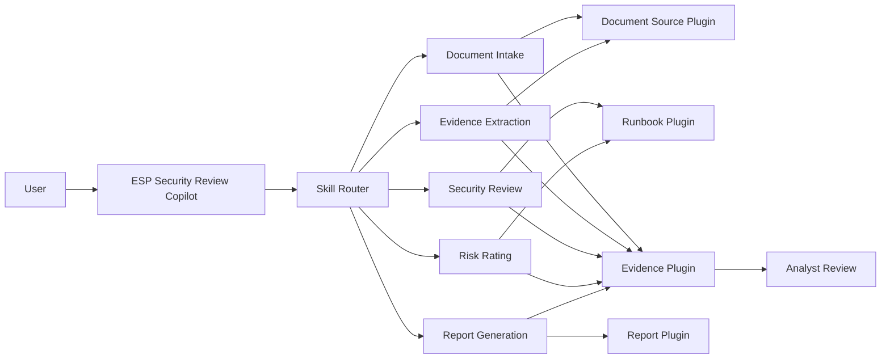
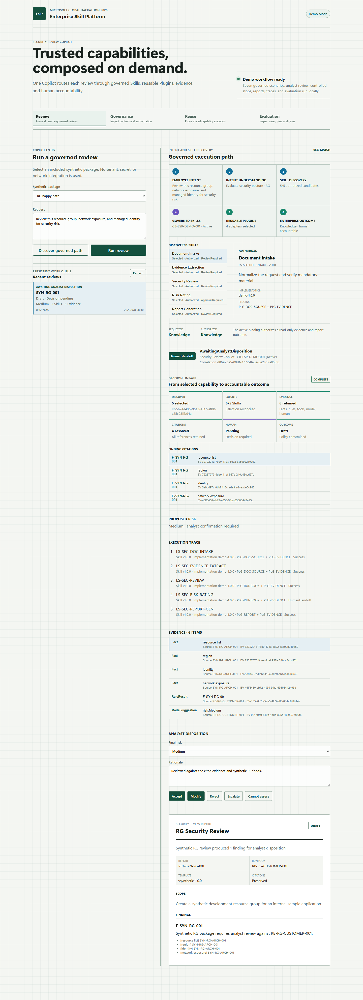

# Enterprise Skill Platform (ESP)

> Move from agent-centric AI to capability-centric AI: build trusted enterprise Skills once, govern them as products, and compose them into any Copilot.

ESP is a Microsoft Global Hackathon 2026 project that changes the unit of enterprise AI reuse from an entire Agent to a governed business capability.

## From AI Agents to Enterprise Capabilities

Enterprises are rapidly adopting Copilots and AI agents across HR, Legal, Sales, Procurement, Security, and Operations. Yet most organizations are unknowingly recreating the same capabilities again and again.

Document intake, evidence extraction, policy checks, risk assessment, decision support, report generation, and approval workflows are commonly embedded inside individual Agents. As the number of Agents grows, so does a hidden estate of duplicated prompts, workflows, integrations, and evaluation logic.

This is not only a maintenance problem. It is an enterprise trust and governance problem. When an Agent produces a recommendation, organizations need to answer:

- Which capability produced this result?
- Which implementation and Plugin versions were used?
- What evidence supported the recommendation?
- Which policies governed the decision?
- Was human oversight required?
- Who owns and supports the capability?

As enterprise AI scales, these questions matter more than the number of Agents deployed.

## The ESP Model

Enterprise Skill Platform treats business capabilities as governed products rather than implementation details hidden inside individual Agents.

ESP introduces a reusable capability layer:

```text
Copilots, Workflows, Applications, and APIs
		      ↓
	 Governed Enterprise Skills
		      ↓
	      Reusable Plugins
		      ↓
	      Enterprise Systems
```

- A **Skill** is a stable business capability with explicit input/output/error contracts, versioned behavior, evidence requirements, evaluation criteria, governance policy, limitations, and human-accountability rules.
- A **Plugin** is a bounded implementation adapter that can evolve independently without changing the Skill contract.
- A **Copilot** is a consumer and composer of Skills, not the owner of private capability implementations.

One Copilot can compose many Skills. One Skill can use multiple Plugins. One Plugin can support multiple Skills. This many-to-many model enables capabilities to be built once, evaluated once, approved once, and reused everywhere.

## Why This Matters

The future challenge for enterprises is not creating more Agents. It is governing AI capabilities at enterprise scale.

A modern organization may deploy hundreds of Copilots, but many require the same core capabilities: risk assessment, policy analysis, evidence collection, compliance validation, decision support, and reporting. ESP provides the foundation to manage these capabilities once and measure what actually matters:

- capability reuse;
- trustworthiness and evidence coverage;
- governance and policy coverage;
- auditability and compliance alignment;
- maintainability and operating cost;
- measurable business impact.

ESP accelerates delivery without trading away explainability, control, or human accountability.

## ESP, MCP, and Agent Platforms

ESP complements rather than replaces MCP, Copilot Studio, or other Agent platforms.

**MCP standardizes how an Agent accesses tools and context.**

```text
Agent → Tool or Resource
```

**ESP standardizes how an enterprise defines, governs, evaluates, releases, and measures business capabilities.**

```text
Copilot → Skill → Plugin → Evidence → Evaluation → Governance
```

MCP can be one Plugin integration mechanism inside ESP. Copilot Studio can be one runtime consumer. ESP adds the capability identity, ownership, contracts, versioning, evidence, evaluation, lifecycle, and value layer above runtime interoperability.

## Hackathon MVP

```text
1 Copilot entry
→ Skill Router
→ 5 versioned Skills
→ 4 reusable Plugins
→ Evidence and human review
→ Draft report and evaluation
```

The mandatory deliverable is a local Demo Mode using synthetic data. Copilot Studio, Power Automate, Dataverse, and the seven enterprise Solutions are an optional Connected Mode and scale-out path; they do not block the local demonstration.

## Why ESP

- **Reuse capabilities, not copied Agents.** A Skill can serve multiple Copilots, workflows, applications, and APIs.
- **Change implementations safely.** Plugins and runtimes can evolve while the Skill contract remains stable.
- **Make evidence part of execution.** Every material factual claim must link to an Evidence Item.
- **Treat failure as a governed outcome.** Missing evidence, policy denial, and human handoff are explicit states.
- **Keep people accountable.** Models can propose risk; an analyst confirms the final decision.
- **Measure real value.** Reuse, quality, risk, adoption, maintainability, and cost remain distinct measures.

## Long-Term Vision

ESP represents a shift from agent-centric architecture to capability-centric architecture. In the same way that APIs transformed software development, governed Skills can transform enterprise AI.

Organizations should not rebuild business intelligence, risk analysis, compliance validation, or evidence extraction inside every new Agent. These capabilities should exist as trusted enterprise products that can be composed into any Copilot, workflow, application, or AI system.

> Enterprises do not need thousands of disconnected AI agents. They need trusted, governed, reusable Skills that can be composed wherever work happens.

ESP is the governance and delivery layer that makes enterprise AI scalable, explainable, reusable, and trustworthy.

## Architecture



The Security Review path is an explicit state machine. Generative orchestration cannot silently reorder mandatory stages, select `Latest`, bypass a denied source, or replace analyst approval.



[Download the automated fallback demo recording](docs/00-Hackathon/assets/esp-demo-fallback.webm)

## Demo Scenarios

The committed synthetic dataset covers:

- resource-group happy path;
- missing mandatory resource and permission information;
- application-registration happy path;
- prompt injection embedded in an untrusted source document.

Expected governed outcomes include `Success`, `NeedsInformation`, `CannotAssess`, `RejectedByPolicy`, `HumanHandoff`, and `Failed`.

Start with:

- [Project brief](docs/00-Hackathon/project-brief.md)
- [Registration content](docs/00-Hackathon/registration-content.md)
- [Paste-ready registration fields](docs/00-Hackathon/registration-paste-ready.md)
- [Additional Information draft](docs/00-Hackathon/additional-information.md)
- [MVP delivery profile](docs/00-Hackathon/mvp-delivery-profile.md)
- [Hackathon backlog](docs/08-Development/hackathon-mvp-backlog.md)
- [Five-minute demo script](docs/00-Hackathon/demo-script.md)
- [Azure Demo deployment plan](docs/00-Hackathon/azure-deployment.md)

## Current Status

| Area | Status |
|---|---|
| Architecture and contracts | Ready |
| Synthetic RG/APP dataset | Ready, pending Domain SME approval for Pilot use |
| Foundation evaluation | 36/36 mandatory synthetic assertions passing |
| Power Platform ALM foundation | Seven Solution projects package successfully |
| Local browser application | Runnable Demo Mode |
| Hosted synthetic Demo | [Azure App Service](https://app-esp-esp-demo-vw6mjjpc4xh64.azurewebsites.net/) |
| Copilot Studio Connected Mode | Optional, environment and governance gated |
| Pilot or Production | Not authorized |

The repository now contains the runnable local Hackathon vertical slice: Copilot-style entry, five Skills, four Plugins, evidence, analyst disposition, structured report, trace, and application evaluation. See the [technical feasibility assessment](docs/09-Feasibility/technical-feasibility-assessment.md) for the enterprise Connected Mode and governance status.

## Data Boundary

Local Hackathon implementation with synthetic, non-sensitive data is permitted. Customer data, Connected TEST, Pilot, Production, production identities, and production connections remain blocked until the Development Readiness Gate is approved.

## Run Demo Mode

One-command production-style demo:

```powershell
npm.cmd run demo
```

Open `http://127.0.0.1:8787`. This command builds the application and starts one local Express process that serves both the UI and API.

Development mode with hot reload:

```powershell
npm.cmd install
npm.cmd run dev
```

Open `http://127.0.0.1:5173`. The API health endpoint remains available at `http://127.0.0.1:8787/api/health`.

The current Demo Mode provides the complete local Hackathon workflow: governed routing, pinned Consumer Bindings, five Skills, four Plugins, evidence, analyst disposition, cited reports, persistence, evaluation, and operational checks.

## Validation

Create or refresh the local validation environment:

```powershell
py -3.12 -m venv .venv
.\.venv\Scripts\python.exe -m pip install -r requirements-dev.txt
```

Run all Foundation checks:

```powershell
Set-ExecutionPolicy -Scope Process -ExecutionPolicy Bypass
.\scripts\Test-FoundationReadiness.ps1
```

Run application tests directly:

```powershell
npm.cmd run test:api
npm.cmd run test:production
npm.cmd run test:e2e
npm.cmd run test:hosted
npm.cmd run evaluate
```

Validate setup from a fresh local clone:

```powershell
.\scripts\Test-CleanClone.ps1
```

Current validation covers:

- 15 valid and 10 invalid Skill contract examples;
- 21 API integration tests;
- four versioned synthetic Security Review cases;
- 36 mandatory evaluation assertions;
- 16 desktop/mobile browser journeys covering governed scenarios, error recovery, accessibility, and keyboard operation;
- Hackathon registration and documentation consistency;
- Dataverse workbook hash and semantic checks;
- seven Power Platform Solution project identities.

Rebuild the synthetic Security Review dataset manifest after an approved dataset change:

```powershell
.\.venv\Scripts\python.exe .\scripts\Build-SyntheticDatasetManifest.py
```

Run the Foundation evaluation against candidate Agent results:

```powershell
.\.venv\Scripts\python.exe .\scripts\Run-SyntheticEvaluation.py
```

## Connected Mode Foundation

Review the planned solutions without changing the workspace:

```powershell
.\scripts\Initialize-PowerPlatformSolutions.ps1 -PlanOnly
```

Actual initialization requires the Power Platform CLI. Install the official Windows MSI from `https://aka.ms/PowerAppsCLI`, review [config/solution-manifest.json](config/solution-manifest.json), and run the script without `-PlanOnly`.

Package all local Solution sources in dependency order:

```powershell
.\scripts\Pack-PowerPlatformSolutions.ps1
```

Architecture and governance documentation begins at [docs/README.md](docs/README.md). These enterprise controls define the scale-out path and do not imply that the local Hackathon MVP is production-authorized.

Foundation work status and ordering are tracked in [docs/08-Development/foundation-backlog.md](docs/08-Development/foundation-backlog.md).

## Repository Metadata

GitHub description:

> From agent-centric to capability-centric AI: governed, reusable Skills for trusted enterprise Copilots.

GitHub topics:

`copilot-studio`, `power-platform`, `ai-agents`, `agentic-ai`, `responsible-ai`, `plugins`, `security-review`, `evidence-grounding`, `human-in-the-loop`, `hackathon-2026`

GitHub homepage: [Hosted ESP Demo](https://app-esp-esp-demo-vw6mjjpc4xh64.azurewebsites.net/)

## Scope and Safety

ESP does not implement a general-purpose Agent factory, custom identity platform, autonomous approval, or unrestricted business-system writes. Demo Plugins are local and must be visibly labelled. Synthetic results do not establish customer validation, Pilot quality, or Production readiness.