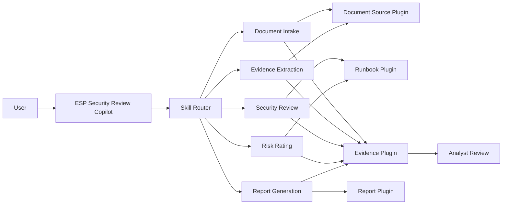

# Enterprise Skill Platform (ESP)

> Build governed AI Skills once, plug them into any Copilot, and trust every outcome through evidence, versioning, and human accountability.

ESP is a Microsoft Global Hackathon 2026 project that changes the unit of enterprise AI reuse from an entire Agent to a governed business capability.

Enterprise teams repeatedly embed document intake, evidence extraction, policy analysis, risk rating, and report generation inside individual Agents. ESP separates those capabilities into stable, versioned **Skills**, connects them to bounded and replaceable **Plugins**, and composes them through one Copilot entry point.

## Hackathon MVP

```text
1 Copilot entry
→ Skill Router
→ 5 versioned Skills
→ 4 reusable Plugins
→ Evidence and human review
→ Draft report and evaluation
```

The mandatory deliverable is a local Demo Mode using synthetic data. Copilot Studio, Power Automate, Dataverse, and the seven enterprise Solutions are an optional Connected Mode and scale-out path; they do not block the local demonstration.

## Why ESP

- **Reuse capabilities, not copied Agents.** A Skill can serve multiple Copilots, workflows, applications, and APIs.
- **Change implementations safely.** Plugins and runtimes can evolve while the Skill contract remains stable.
- **Make evidence part of execution.** Every material factual claim must link to an Evidence Item.
- **Treat failure as a governed outcome.** Missing evidence, policy denial, and human handoff are explicit states.
- **Keep people accountable.** Models can propose risk; an analyst confirms the final decision.
- **Measure real value.** Reuse, quality, risk, adoption, maintainability, and cost remain distinct measures.

## Architecture



The Security Review path is an explicit state machine. Generative orchestration cannot silently reorder mandatory stages, select `Latest`, bypass a denied source, or replace analyst approval.

## Demo Scenarios

The committed synthetic dataset covers:

- resource-group happy path;
- missing mandatory resource and permission information;
- application-registration happy path;
- prompt injection embedded in an untrusted source document.

Expected governed outcomes include `Success`, `NeedsInformation`, `CannotAssess`, `RejectedByPolicy`, `HumanHandoff`, and `Failed`.

Start with:

- [Project brief](docs/00-Hackathon/project-brief.md)
- [Registration content](docs/00-Hackathon/registration-content.md)
- [MVP delivery profile](docs/00-Hackathon/mvp-delivery-profile.md)
- [Hackathon backlog](docs/08-Development/hackathon-mvp-backlog.md)
- [Five-minute demo script](docs/00-Hackathon/demo-script.md)

## Current Status

| Area | Status |
|---|---|
| Architecture and contracts | Ready |
| Synthetic RG/APP dataset | Ready, pending Domain SME approval for Pilot use |
| Foundation evaluation | 36/36 mandatory synthetic assertions passing |
| Power Platform ALM foundation | Seven Solution projects package successfully |
| Local browser application | In development |
| Copilot Studio Connected Mode | Optional, environment and governance gated |
| Pilot or Production | Not authorized |

The repository is currently a validated implementation foundation, not yet the completed runnable Hackathon application. See the [technical feasibility assessment](docs/09-Feasibility/technical-feasibility-assessment.md) for the precise Go/No-Go status.

## Data Boundary

Local Hackathon implementation with synthetic, non-sensitive data is permitted. Customer data, Connected TEST, Pilot, Production, production identities, and production connections remain blocked until the Development Readiness Gate is approved.

## Validation

Create or refresh the local validation environment:

```powershell
py -3.12 -m venv .venv
.\.venv\Scripts\python.exe -m pip install -r requirements-dev.txt
```

Run all Foundation checks:

```powershell
Set-ExecutionPolicy -Scope Process -ExecutionPolicy Bypass
.\scripts\Test-FoundationReadiness.ps1
```

Current validation covers:

- 15 valid and 10 invalid Skill contract examples;
- four versioned synthetic Security Review cases;
- 36 mandatory evaluation assertions;
- Hackathon registration and documentation consistency;
- Dataverse workbook hash and semantic checks;
- seven Power Platform Solution project identities.

Rebuild the synthetic Security Review dataset manifest after an approved dataset change:

```powershell
.\.venv\Scripts\python.exe .\scripts\Build-SyntheticDatasetManifest.py
```

Run the Foundation evaluation against candidate Agent results:

```powershell
.\.venv\Scripts\python.exe .\scripts\Run-SyntheticEvaluation.py
```

## Connected Mode Foundation

Review the planned solutions without changing the workspace:

```powershell
.\scripts\Initialize-PowerPlatformSolutions.ps1 -PlanOnly
```

Actual initialization requires the Power Platform CLI. Install the official Windows MSI from `https://aka.ms/PowerAppsCLI`, review [config/solution-manifest.json](config/solution-manifest.json), and run the script without `-PlanOnly`.

Package all local Solution sources in dependency order:

```powershell
.\scripts\Pack-PowerPlatformSolutions.ps1
```

Architecture and governance documentation begins at [docs/README.md](docs/README.md). These enterprise controls define the scale-out path and do not imply that the local Hackathon MVP is production-authorized.

Foundation work status and ordering are tracked in [docs/08-Development/foundation-backlog.md](docs/08-Development/foundation-backlog.md).

## Repository Metadata

Suggested GitHub description:

> Governed, reusable AI Skills and Plugins for trusted enterprise Copilots. Microsoft Global Hackathon 2026.

Suggested GitHub topics:

`copilot-studio`, `power-platform`, `ai-agents`, `agentic-ai`, `responsible-ai`, `plugins`, `security-review`, `evidence-grounding`, `human-in-the-loop`, `hackathon-2026`

## Scope and Safety

ESP does not implement a general-purpose Agent factory, custom identity platform, autonomous approval, or unrestricted business-system writes. Demo Plugins are local and must be visibly labelled. Synthetic results do not establish customer validation, Pilot quality, or Production readiness.