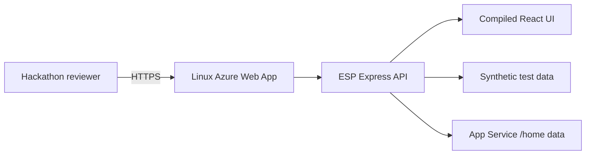

# Azure Demo Deployment

This plan hosts the synthetic, non-sensitive ESP Demo Mode on one Linux Azure App Service instance. It does not deploy Connected Mode, Microsoft Foundry, a model, customer data, Dataverse, or production credentials.

## Target

- Subscription: `MCAPS-Hybrid-REQ-67295-2023-limzha` (`1a55f4f7-6677-4773-8ba8-2cc1c46cb083`)
- Tenant: `fdpo.onmicrosoft.com` (`16b3c013-d300-468d-ac64-7eda0820b6d3`)
- Existing resource group: `ESP`
- Region: `southeastasia`
- Compute: Linux App Service Plan, B1, one instance
- Runtime: Node.js 24 LTS
- Health path: `/api/health`
- Persistent Demo review path: `/home/data/esp`
- Cost and lifecycle owner: Liming
- Continue-or-teardown review date: 2026-09-18

Azure CLI verified that resource group `ESP` exists in Southeast Asia with provisioning state `Succeeded` and contains no App Service Plan or Web App. The Azure extension remains signed into a different tenant; Azure extension and CLI/azd authentication contexts are isolated.

## Architecture



## Prerequisites

1. Install Azure Developer CLI 1.20.0 or later.
2. Authenticate to tenant `16b3c013-d300-468d-ac64-7eda0820b6d3`.
3. Select subscription `1a55f4f7-6677-4773-8ba8-2cc1c46cb083`.
4. Confirm that organizational policy permits `Microsoft.Web` resources in the existing `ESP` resource group.

## Planned Commands

Run these only after the subscription and resource-group checks succeed:

```powershell
azd auth login --tenant-id 16b3c013-d300-468d-ac64-7eda0820b6d3
azd env new esp-demo
azd env set AZURE_SUBSCRIPTION_ID 1a55f4f7-6677-4773-8ba8-2cc1c46cb083
azd env set AZURE_LOCATION southeastasia
azd env set AZURE_RESOURCE_GROUP ESP
azd provision --preview
azd up
```

## Preview Evidence

On 2026-09-04, Azure CLI resource-group `what-if` completed with status `Succeeded`, no diagnostics, and no error. The preview proposed only these creates:

- App Service Plan `asp-esp-esp-demo`;
- Web App `app-esp-esp-demo-vw6mjjpc4xh64`;
- FTP and SCM basic publishing credential policies;
- Web App application settings.

The preview did not create or modify Azure resources. Azure Developer CLI 1.33.0 ARM64 was installed from the official alpha release archive after verifying SHA-256 `27dbc0b69c7facff26cd174ab5f16f07a39c029b8c11a41dd945fab6a6cd0c58`. The local `esp-demo` azd environment was created and pinned to the approved subscription and region. On this Windows ARM64 machine, `azd provision --preview` did not complete, so the successful Azure CLI `what-if` against the same compiled Bicep template is the authoritative preview evidence. Azure Resource Graph reconfirmed zero App Service Plans and zero Web Apps after both preview attempts.

## Deployment Evidence

Initial deployment completed on 2026-09-04. Review-store recovery hardening from protected `main` commit `44795a2` was deployed and validated on 2026-09-06:

- Public Demo: `https://app-esp-esp-demo-vw6mjjpc4xh64.azurewebsites.net/`
- Health endpoint: HTTP 200 with `status=healthy`, `mode=Demo`, five Skills, and four Plugins
- Active deployment ID: `b6a88691-7215-4fe6-abd2-c3ddfe271b24`, deployer `Push-Deployer`, status `4` (Success), zero build warnings or errors
- Previous initial OneDeploy ID: `b8f82d2b-15da-47db-9d3a-5bcfe2d946da`, status `4` (Success)
- Four live scenarios returned their expected governed states with zero runtime violations
- Analyst acceptance produced a Final report and one HumanDecision Evidence Item
- Correlation `06aeaad2-4bac-4d72-991d-074aa83359d5` remained Completed/Final/Accept after an App Service restart
- Desktop and 390px mobile browser checks reported no horizontal overflow
- Helmet CSP/HSTS/nosniff/referrer headers, same-origin browser access, and the API rate limit are active
- Production and full dependency audits report zero known vulnerabilities
- `npm run test:hosted` automates health, security headers, all four governed scenarios, and a 390px Chromium smoke
- Post-deployment `npm run test:hosted` passed against the hardened deployment on 2026-09-06

The first remote build excluded development build tools because `NODE_ENV=production`, and the pre-deployment container also started before the Oryx manifest was active. The final configuration sets `NPM_CONFIG_INCLUDE=dev`; after successful Oryx build and a clean App Service restart, the deployed application passed all checks.

Keep one instance because the Demo review store uses a process-local write queue and is not a distributed datastore. Each successful write uses a synced temporary file, atomic replacement, and a last-known-good backup; a missing or malformed primary store is repaired from that backup.

## Security And Operations

- HTTPS only; TLS 1.2 minimum; HTTP/2 enabled.
- FTP and SCM basic authentication disabled.
- No application secrets or connection strings.
- Public endpoint contains only synthetic demonstration data.
- B1 Always On avoids presentation cold starts.
- The application remains explicitly non-production and not Pilot-authorized.
- On 2026-09-18, Liming must record a continue-or-teardown decision; delete the Web App and Plan if the public Demo is no longer required.