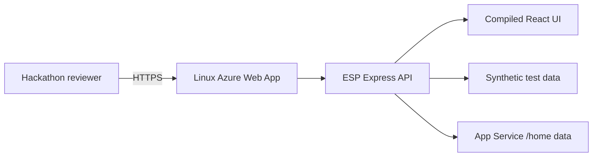

# Azure Demo Deployment

This plan hosts the synthetic, non-sensitive ESP Demo Mode on one Linux Azure App Service instance. It does not deploy Connected Mode, Microsoft Foundry, a model, customer data, Dataverse, or production credentials.

## Target

- Subscription: `MCAPS-Hybrid-REQ-67295-2023-limzha` (`1a55f4f7-6677-4773-8ba8-2cc1c46cb083`)
- Tenant: `fdpo.onmicrosoft.com` (`16b3c013-d300-468d-ac64-7eda0820b6d3`)
- Existing resource group: `ESP`
- Region: `southeastasia`
- Compute: Linux App Service Plan, B1, one instance
- Runtime: Node.js 24 LTS
- Health path: `/api/health`
- Persistent Demo review path: `/home/data/esp`

Azure CLI verified that resource group `ESP` exists in Southeast Asia with provisioning state `Succeeded` and contains no App Service Plan or Web App. The Azure extension remains signed into a different tenant; Azure extension and CLI/azd authentication contexts are isolated.

## Architecture



## Prerequisites

1. Install Azure Developer CLI 1.20.0 or later.
2. Authenticate to tenant `16b3c013-d300-468d-ac64-7eda0820b6d3`.
3. Select subscription `1a55f4f7-6677-4773-8ba8-2cc1c46cb083`.
4. Confirm that organizational policy permits `Microsoft.Web` resources in the existing `ESP` resource group.

## Planned Commands

Run these only after the subscription and resource-group checks succeed:

```powershell
azd auth login --tenant-id 16b3c013-d300-468d-ac64-7eda0820b6d3
azd env new esp-demo
azd env set AZURE_SUBSCRIPTION_ID 1a55f4f7-6677-4773-8ba8-2cc1c46cb083
azd env set AZURE_LOCATION southeastasia
azd env set AZURE_RESOURCE_GROUP ESP
azd provision --preview
azd up
```

## Preview Evidence

On 2026-09-04, Azure CLI resource-group `what-if` completed with status `Succeeded`, no diagnostics, and no error. The preview proposed only these creates:

- App Service Plan `asp-esp-esp-demo`;
- Web App `app-esp-esp-demo-vw6mjjpc4xh64`;
- FTP and SCM basic publishing credential policies;
- Web App application settings.

The preview did not create or modify Azure resources. Azure Developer CLI 1.33.0 ARM64 was installed from the official alpha release archive after verifying SHA-256 `27dbc0b69c7facff26cd174ab5f16f07a39c029b8c11a41dd945fab6a6cd0c58`. The local `esp-demo` azd environment was created and pinned to the approved subscription and region. On this Windows ARM64 machine, `azd provision --preview` did not complete, so the successful Azure CLI `what-if` against the same compiled Bicep template is the authoritative preview evidence. Azure Resource Graph reconfirmed zero App Service Plans and zero Web Apps after both preview attempts.

After deployment, validate the `SERVICE_WEB_URI` output, `/api/health`, all four synthetic scenarios, analyst disposition, persistence after restart, and App Service logs. Keep one instance because the Demo review store uses one JSON file with a process-local write queue.

## Security And Operations

- HTTPS only; TLS 1.2 minimum; HTTP/2 enabled.
- FTP and SCM basic authentication disabled.
- No application secrets or connection strings.
- Public endpoint contains only synthetic demonstration data.
- B1 Always On avoids presentation cold starts.
- The application remains explicitly non-production and not Pilot-authorized.
- Delete the Web App and Plan after the Hackathon if the public Demo is no longer required.